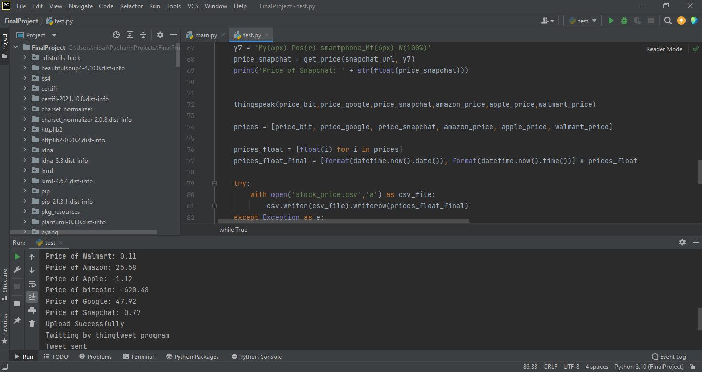
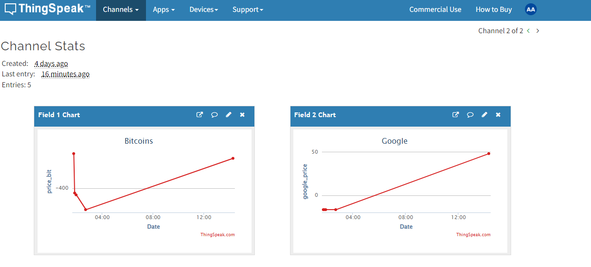
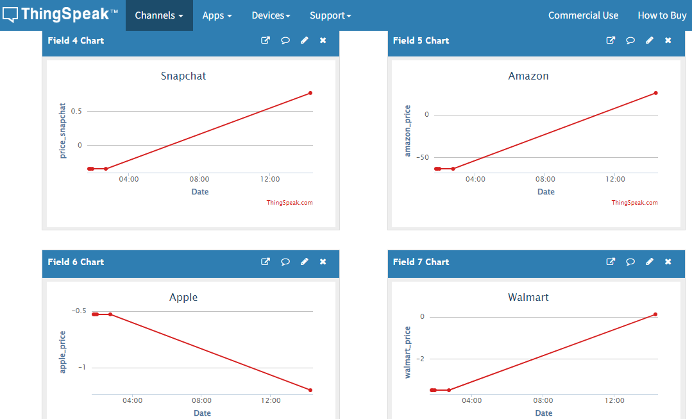
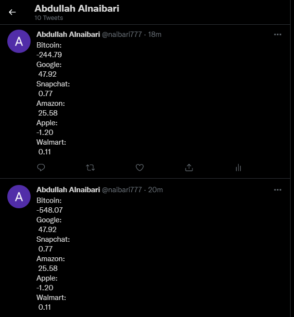
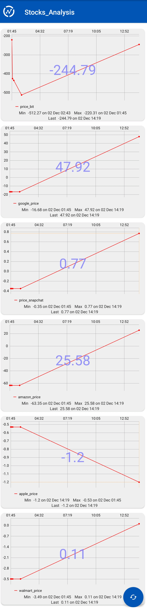

# Collecting Stock Current Values and Uploading It to ThingSpeak
Every 60 seconds, the stocks monitor project collects the current stock value of the following companies: Bitcoin, Google, Amazon, Walmart, Apple, and Snapchat. The code will run until the developer ends it. Furthermore, all information is captured and published to ThinkSpeak.com. Aside from that, the most recent prices will be posted on a Twitter page dedicated to this project. This would create a data history for the consumer to peruse and determine whether or not the company is worth investing in. Through the Thinksview app, the user will be able to check the reading. For each company, there will be charts that display the current and previous stock prices.                                             
Twitter page: https://twitter.com/naibari777
## The results are shown below:

## Thinksview App:

